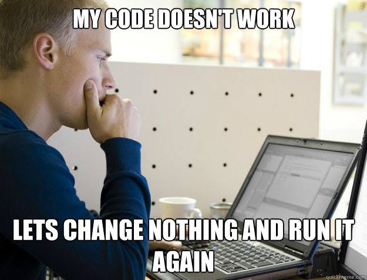

<header class="masthead" style="('https://miro.medium.com/v2/resize:fit:1250/1*FL21qjWA7JboicY-S2nS0Q.jpeg')">
  
  <header class="masthead">
    

    

      

        

          

            <h1>Bobby Ressnowski</h1>
<body background = "wallpaper-mania.com_High_resolution_wallpaper_background_ID_77700372477.jpg">                
                Learning to code from Zero to Competent. I'll blog about it here.
  
 
 
 

  

    

      

A couple of months ago I decided to try to learn how to code. I was feeling stuck in a dead end job, and looking for something that could both be a good hobby for me as well as something I could potentially build into a skill or even career. I decided to code because I have a dream of one day making simple video games. This is a crazy fantasy, but still something to reach for which is more than i've had in a while. So here I go. I started learning C# online using microsoft resources and have slowly explored deeper into programming as a whole. I feel like a little fish in an enormous pond and I kinda love it. Everything is new and I feel like there are endless possibilites. What I mean by that of course is a TON to learn.lol but still, I'm making progress every day and hoping to turn this into something real. For now my goal is to learn C# and uinity to the best of my ability as well as some HTML and whatever else is required to maintain this simple website. I plan to try to post here to update my progress and hold myself accountable. Plus it will be neat to look over my journey. Anyway, that's enough about me. I'm going to bed.

  

   
   

  
   
   
this looks like a powerpoint slide lol

</body>
 

